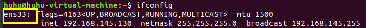
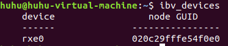
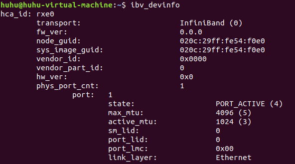
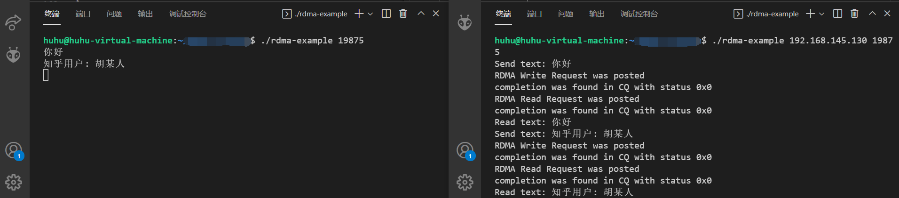
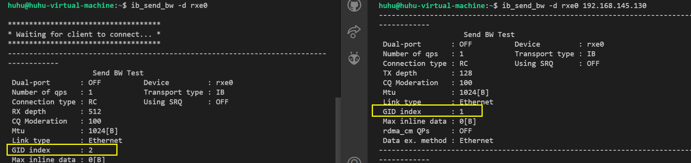

# RDMA学习-如何在两台虚拟机之间使用Soft-RoCE进行编程实验

> 第一次写这种博客，初学RDMA，写得不对的地方还望谅解~

### 1 背景知识-RoCEv2和Infiniband的不同

RoCEv2和Infiniband的RDMA虽然都可以使用相同的verbs进行编程，但是RoCEv2一些细节还是有所不同：

* 不需要子网管理员Subnet Mangaer
* LID为0，需要使用GRH，gid_idx要大于等于0
* RC QP中的alternate path（即ibv_qp_attr中的alt_ah_attr）不需要设置

### 2 实验环境

虚拟机的Linux distribution version：ubuntu18.04（4核，内存4G，网络模式是NAT）（需要两台，使用VMware的虚拟机克隆即可快速生成第二台，建议在把下面的环境配置好后再进行虚拟机克隆）

### 3 环境配置

* 安装写代码要用的相关library

  ```shell
  sudo apt-get install libibverbs-dev
  sudo apt-get install librdmacm-dev
  ```
* 加载Soft-RoCE内核模块（ubuntu18.04中自带rdma-core了，可以直接用）

  ```shell
  modprobe rdma_rxe	# rxe就是Soft-RoCE
  ```
* 查看当前系统中的网络设备

  ```shell
  ifconfig	# 例如下图中的ens33, 记住这个设备名
  ```

  
* 启动Soft-RoCE（注意这一步在ubuntu20.04中不是这样的，只是ubuntu18.04用的是rxe_cfg）

  ```shell
  sudo rxe_cfg start
  ```
* 生成RDMA设备

  ```
  sudo rxe_cfg add ens33	# 这个ens33是刚才ifconfig中查到的设备名
  ```
* 查看生成的设备

  ```shell
  ibv_devices	# 可以看到新生成的设备名称是rxe0
  ```

  

  ```shell
  ibv_devinfo	# 查看设备的详细信息
  ```

  

OK到这一步差不多了，可以开始写代码了。（ibv_get_device_list已经可以拿到我们刚创建的这个device了）

### 4 我的代码

> 基于github上的《RDMA-Tutorial》以及Mellanox官方的《RDMA Aware Networks ProgrammingUser Manual》中的Example Code，作了一些魔改，简化成了一个只使用RDMA Write & Read的在两台虚拟机之间进行简单通信的程序（对于刚入门的选手更加直观、简单）

> 其实环境配置好后就可以去跑网络上现有的RDMA程序了，例如github上的《RDMA-Tutorial》。

这里只展示部分代码，写得不怎么规范，就不开源了。优秀的开源项目可以去看《[RDMA-Tutorial](https://github.com/jcxue/RDMA-Tutorial)》或《[RDMA Aware Networks ProgrammingUser Manual](https://www.mellanox.com/related-docs/prod_software/RDMA_Aware_Programming_user_manual.pdf)》中的Example Code。这里只是我自己动手用一下这些API函数来加深印象加深理解。

#### 4.1 最后的效果

最后的效果就是Client可以直接通过RDMA Write直接修改Server中的内存，Server只是在不断循环检查自己内存中的buf，发现有变化就打印出buf中的内容。



#### 4.2 代码关键

> 代码力求简单，只是用来学习学习

##### 4.2.1 Server

```cpp
int run_server()
{
    char *buf_ptr = ib_res.ib_buf;
  
    /* 一直循环显示服务器缓冲区, 直到开头字符为'q' */
    char prev_char = (*buf_ptr);
    while((*buf_ptr) != 'q'){
        while((*buf_ptr) == prev_char){
            sleep(1);
        }
        fprintf(stdout, "%s", buf_ptr);
        prev_char = (*buf_ptr);
    }

    return 0;
}
```

ib_buf就是已经注册成Memory Region的一块内存，服务器要做的就是不断循环去判断首字母是否变化，有变化则printf出来。当用户发送过来的首字母是q则会结束程序。

之所以在循环里加个sleep，其实我也不知道具体原因，反正如果不加sleep的话，服务器端不会显示客户端最新write的数据。猜测原因可能是Soft-RoCE其实本质上也是软件模拟的，需要用到CPU，而sleep能阻塞进程，才避免这个while循环一直霸占CPU而导致buf_ptr中的数据得不到刷新（?）

##### 4.2.2 Client

```cpp
int run_client()
{
    struct ibv_cq *cq   = ib_res.cq;
    char *buf_ptr       = ib_res.ib_buf;
    size_t buf_size     = ib_res.ib_buf_size;

    while((*buf_ptr) != 'q')
    {
        fprintf(stdout, "Send text: ");
        check(fgets(buf_ptr, buf_size, stdin) != NULL, "client: fgets failed.");

        check(post_send(&ib_res, IBV_WR_RDMA_WRITE) == 0, "client: failed to write.");
        check(poll_completion(cq) == 0, "client: poll completion failed.");
  
        memset(ib_res.ib_buf, 0, ib_res.ib_buf_size);
        check(post_send(&ib_res, IBV_WR_RDMA_READ) == 0, "client: failed to read.");
        check(poll_completion(cq) == 0, "client: poll completion failed.");
        fprintf(stdout, "Read text: %s", buf_ptr);
    }

    return 0;
error:
    return -1;
}
```

上面代码中函数 ``post_send``、``poll_completion``都是《RDMA Aware Networks ProgrammingUser Manual》中的示例函数，大家可以查阅此文档来进一步深入了解（小技巧：阅读文档时 ``Ctrl+F``搜索这些函数名就能很快查到相关内容）。``check``函数是一个宏，判断里面的函数返回值是否正确，不正确则打印后面的字符串并跳转到error处。

### 5 踩坑记录

在debug中遇到了一些非常离谱的问题，在这里记录下，希望能帮助到遇到同样问题的人。

#### 5.1 Failed to change qp to rtr. Errno: Invalid argument.

我遇到这个问题是因为当初没有使用gid。RoCEv2与Infiniband的不同之一就是RoCEv2底层是使用的传统Ethernet，用不到LID（LID是在IB子网中用到的一种数据，RoCE中LID恒为0）。在RoCE中，即使是一台主机上的两台虚拟机通信，也要用到gid，即is_global要为1.

```cpp
if (target_lid == 0)
{
	qp_attr.ah_attr.is_global = 1;
	qp_attr.ah_attr.port_num = IB_PORT; /* Must */
	qp_attr.ah_attr.grh.sgid_index = config_info.gid_idx;
	memcpy(&qp_attr.ah_attr.grh.dgid, dgid, 16);
	qp_attr.ah_attr.grh.hop_limit = 0xFF;
	qp_attr.ah_attr.grh.flow_label = 0;
	qp_attr.ah_attr.grh.traffic_class = 0;
}
```

#### 5.2 Failed to change qp to rtr. Errno: Connection timeout

这个问题是我解决了前一个问题后才新冒出来的，后来在网上查了很久的资料也没找到有效方法解决。其实这个问题的原因其实就是 ``gid_index``没有设置对。

首先得知道gid是啥，gid我把它看作是传统网络里的IP地址，在代码中是一个16个uint8_t的数组。RDMA设备的一个物理端口（port_num）其实对应不只一个gid，我们可以通过函数 ``ibv_query_gid``获取到一个设备的某个端口上的第x个gid。

然后得知道，一个设备不同gid分别支持哪些协议，例如一些博客中写的 ``show_gids``指令：

```cpp
$ show_gids
DEV     PORT    INDEX   GID                                     IPv4            VER     DEV
---     ----    -----   ---                                     ------------    ---     ---
mlx5_4  1       0       fe80:0000:0000:0000:ee0d:9aff:fe2f:c21a                 v1      p1p1
mlx5_4  1       1       fe80:0000:0000:0000:ee0d:9aff:fe2f:c21a                 v2      p1p1
```

其中的VER就是表明这个gid是可以用在RoCEv1还是RoCEv2上。

然而show_gids指令是必须安装了OFED驱动才有的指令，我的Linux系统还没安装OFED驱动，因此也没有这个指令。后来我用了一种取巧的方法解决了此问题，那就是用 ``ibv_send_bw``测试指令。（在我的环境里rping、ibv_send_bw测试都能跑通，ibv_rc_pingpong测试跑不了，后来查阅资料说pingpong测试只支持Infiniband）



如上图，可以看到在ib_send_bw中，服务器端（左）用的gid_index为2，客户端（右）用的gid_index为1，因此我在代码中也是硬编码地让服务器端使用gid_index=2，客户端使用gid_index=1，这样就解决了此问题。（使用RDMA verbs的话貌似程序可以自动选择正确的gid_index，在这里只用了VPI verbs）

#### 5.3 Completion wasn't found in the CQ after timeout

这个错误就是说发送RDMA请求后，等了很久也没得到这个WR完成时生成的WC。我debug了很久才发现是因为在生成WRITE请求时我把 ``ibv_send_wr``里的remote addr填错了。写代码时还是要专心，不然会浪费大量时间...

### 6 参考资料

[15.RDMA之RoCE &amp; Soft-RoCE](https://zhuanlan.zhihu.com/p/361740115)

[RoCEv1/v2 安装体验](https://zhuanlan.zhihu.com/p/32105832)

[Runsisi&#39;s Blog-Soft RoCE](https://runsisi.com/2021/02/21/soft-roce/)

[[RoCE]RDMA over Converged Ethernet模式以及配置](https://www.cnblogs.com/burningTheStar/p/8565612.html)
